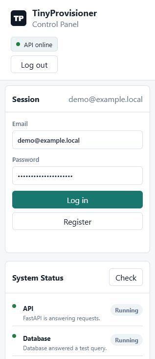
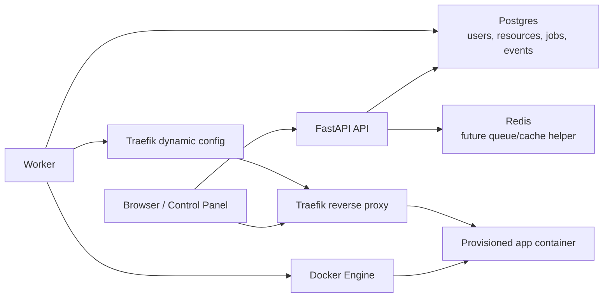

# TinyProvisioner

TinyProvisioner is a learning-first compute provisioning control plane built with Python, FastAPI, Docker, Postgres, Redis, and Traefik. It accepts authenticated resource requests, records desired state, queues lifecycle work, provisions Docker-backed workloads, routes traffic through a reverse proxy, and exposes system health checks for debugging.

This project is intentionally small, but it models the same core ideas behind platforms such as game server hosts, VPS providers, and platform-as-a-service tools: separate the request path from the infrastructure work, keep state in a database, and make background workers responsible for slow provisioning actions.

## Why This Project Exists

I built this to practice DevOps, networking, and security fundamentals in a concrete way:

- Control plane vs data plane separation
- Authenticated API design
- Resource lifecycle modeling
- Background jobs and events
- Docker provisioning
- Private container networking
- Reverse proxy routing with Traefik
- Postgres-backed state
- Redis as stack infrastructure for future queue/cache work
- Health checks and operational debugging
- Local deployment with Docker Compose
- Test-driven safety around lifecycle behavior

## Screenshot



## Architecture



## Request Flow

```text
Browser
  -> API accepts an authenticated request
  -> Database stores a resource and queued job
  -> Worker finds the queued job
  -> Docker creates or changes the container
  -> Worker updates the database and route config
  -> Traefik routes the hostname to the container
  -> Browser opens the provisioned app URL
```

## Current Features

- Browser control panel at `http://127.0.0.1:8000/`
- Register/login with hashed passwords and bearer tokens
- Template-backed resource creation
- Resource lifecycle states: waiting, provisioning, running, stopping, stopped, starting, deleting, deleted, failed
- Database-backed jobs and events
- Docker-backed provisioning mode
- Tiny Python HTTP app as the first provisioned workload
- Traefik file-provider routing for provisioned apps
- Container hardening basics: no Docker socket in user containers, dropped capabilities, no-new-privileges, read-only filesystem, memory and CPU limits
- Resource quota and TTL cleanup guardrails
- Workload logs endpoint
- System Status panel for API, database, Redis, Docker, worker, and Traefik
- Test suite covering auth, lifecycle behavior, Docker provisioning, cleanup, compose config, and UI serving

## Tech Stack

| Area | Tooling |
| --- | --- |
| API | Python, FastAPI, Pydantic |
| Database | Postgres, SQLAlchemy, Alembic |
| Worker | Python worker loop with database-backed jobs |
| Provisioning | Docker Engine |
| Routing | Traefik reverse proxy |
| Cache/queue foundation | Redis |
| Local runtime | Docker Compose |
| Testing | Pytest, Ruff |

## Local Quickstart

Copy the example environment:

```powershell
Copy-Item .env.example .env
```

Start the safe local stack with the fake provisioner:

```powershell
docker compose up --build
```

Run migrations and seed the first template:

```powershell
docker compose exec api alembic upgrade head
docker compose exec api python -m app.seed
```

Open the control panel:

```text
http://127.0.0.1:8000/
```

## Docker Provisioning Mode

Build the app and the tiny workload image:

```powershell
docker compose -f docker-compose.yml -f docker-compose.docker.yml --profile templates build
```

Start the Docker-backed stack:

```powershell
docker compose -f docker-compose.yml -f docker-compose.docker.yml up -d
```

Run migrations and seed data:

```powershell
docker compose -f docker-compose.yml -f docker-compose.docker.yml exec api alembic upgrade head
docker compose -f docker-compose.yml -f docker-compose.docker.yml exec api python -m app.seed
```

Run the smoke test:

```powershell
docker compose -f docker-compose.yml -f docker-compose.docker.yml exec api python scripts/smoke_test.py --base-url http://127.0.0.1:8000 --check-workload-url --workload-proxy-url http://host.docker.internal
```

## Learning Guide

This repo is meant to be studied, not just run. Start here:

- [Study Guide](docs/STUDY_GUIDE.md)
- [Guided Code Walkthrough](docs/CODE_WALKTHROUGH.md)
- [Glossary](docs/GLOSSARY.md)
- [Flashcards And Labs](docs/FLASHCARDS_AND_LABS.md)
- [Local Runtime Validation](docs/LOCAL_RUNTIME_VALIDATION.md)
- [Security Checklist](docs/SECURITY_CHECKLIST.md)
- [VPS Runbook](docs/VPS_RUNBOOK.md)

## What I Learned

- The API should stay fast and queue slow infrastructure work.
- The worker owns provisioning because Docker actions can take time, fail, or need retries.
- The database is the control plane memory: it records desired state, actual state, jobs, events, URLs, external IDs, and audit history.
- A deleted workload and a deleted database row are not the same thing. The container can be removed while the database keeps a historical record.
- Reverse proxies let many workloads share clean hostnames without publishing every container port directly to the host.
- Health checks are not just nice UI. They help identify whether a stuck resource is an API, worker, Docker, database, Redis, or proxy problem.
- Security boundaries matter. User-created containers should not receive the Docker socket or unnecessary Linux capabilities.

## Known Limitations

This is a learning project and not production-ready yet.

- No payment, billing, or customer account management
- No multi-host scheduler
- No real Redis-backed queue yet
- No advanced RBAC beyond basic user ownership
- No full TLS automation in local mode
- No persistent per-workload volumes
- No image allowlist enforcement beyond seeded templates
- No distributed locking for multiple workers
- No production observability stack such as Prometheus, Grafana, or structured log shipping
- Docker socket access still makes the API and worker highly trusted services

## Security Notes

- `.env` is ignored by Git and should not be committed.
- `.env.example` contains safe local defaults only.
- User containers do not receive the Docker socket.
- Workloads run on a private Docker bridge network.
- Workload ports are not directly published to the host.
- The Docker backend applies basic container restrictions.
- The API and worker are trusted control-plane services because they can access Docker.

## Test And Quality Commands

```powershell
.\.venv\Scripts\python.exe -m pytest
.\.venv\Scripts\python.exe -m ruff check .
```

Current local verification:

```text
39 passed
All checks passed
```

## Resume Bullets

Long version:

> Built a Python/FastAPI compute provisioning control plane that accepts authenticated resource requests, queues lifecycle jobs, provisions Docker workloads, routes traffic through Traefik, stores state in Postgres, and exposes health/debug status for API, worker, Docker, Redis, and proxy services.

Short version:

> Built a Docker-backed compute provisioning platform with FastAPI, Postgres, Traefik, Redis, background workers, lifecycle jobs, and system health checks.

## Next Improvements

- Move job execution to Redis/RQ or another real queue backend.
- Add worker heartbeat tracking instead of inferring worker status from Docker.
- Add container image allowlists and stronger template validation.
- Add structured JSON logs and metrics.
- Add TLS automation for VPS deployment.
- Add per-resource volume cleanup and storage quotas.
- Add GitHub Actions for test automation.
