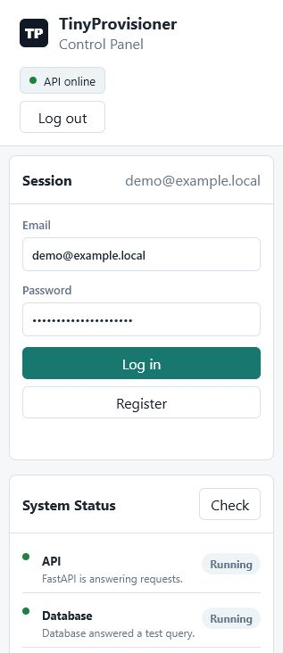
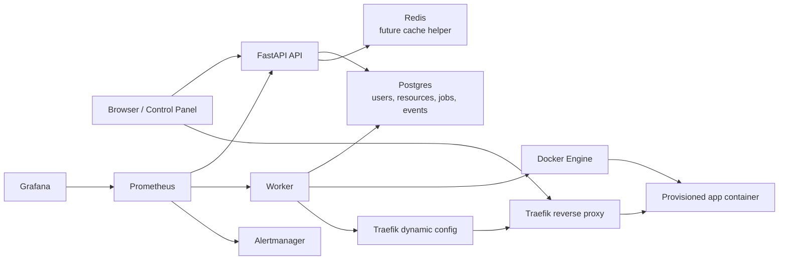

# TinyProvisioner

TinyProvisioner is my attempt to understand what actually happens behind a "create server" button.

The project started as a way to practice DevOps, networking, and security fundamentals in one place. A user can log in, request a small workload, and watch the system record the request, queue background work, create a Docker container, and route traffic to it through Traefik.

This is not production hosting software. It is a hands-on learning project that models the shape of a small compute provisioning platform: API first, state in Postgres, slow infrastructure work in a worker, containers on a private network, and operational checks to debug what is running.

## Why I Built This

I am studying DevOps and security, and I wanted a project that forced me to connect the pieces instead of learning them in isolation. TinyProvisioner gave me a reason to practice:

- Control plane vs data plane separation
- Authenticated API design
- Resource lifecycle modeling
- Background jobs and events
- Docker provisioning
- Private container networking
- Reverse proxy routing with Traefik
- Postgres-backed state
- PostgreSQL-backed job queue with worker leases and retries
- Structured JSON logs with request and job correlation fields
- Prometheus metrics, Grafana dashboards, and symptom-based alerts
- Redis as stack infrastructure for future cache and rate-limit work
- Health checks and operational debugging
- Local deployment with Docker Compose
- Test-driven safety around lifecycle behavior

## Screenshot



## Architecture


```mermaid
flowchart LR
    Browser["Browser / Control Panel"] --> API["FastAPI API"]
    API --> DB["Postgres\nusers, resources, jobs, events"]
    API --> Redis["Redis\nfuture cache helper"]
    Worker["Worker"] --> DB
    Prometheus["Prometheus"] --> API
    Prometheus --> Worker
    Grafana["Grafana"] --> Prometheus
    Prometheus --> Alertmanager["Alertmanager"]
    Worker --> Docker["Docker Engine"]
    Worker --> TraefikConfig["Traefik dynamic config"]
    Docker --> App["Provisioned app container"]
    Traefik["Traefik reverse proxy"] --> App
    Browser --> Traefik
    TraefikConfig --> Traefik
```

## Request Flow

```text
Browser
  -> API accepts an authenticated request
  -> Database stores a resource and queued job
  -> Worker finds the queued job
  -> Docker creates or changes the container
  -> Worker updates the database and route config
  -> Traefik routes the hostname to the container
  -> Browser opens the provisioned app URL
```

## Current Features

- Browser control panel at `http://127.0.0.1:8000/`
- Register/login with hashed passwords and bearer tokens
- Template-backed resource creation
- Resource lifecycle states: waiting, provisioning, running, stopping, stopped, starting, deleting, deleted, failed
- Database-backed jobs and events
- Atomic PostgreSQL job claiming with `FOR UPDATE SKIP LOCKED`
- Capped exponential retries, dead-letter jobs, and abandoned-lease recovery
- Database-backed worker and job heartbeats
- Docker-backed provisioning mode
- Tiny Python HTTP app as the first provisioned workload
- Tiny Browser Game as a functional portfolio workload
- Traefik file-provider routing for provisioned apps
- Container hardening basics: no Docker socket in user containers, dropped capabilities, no-new-privileges, read-only filesystem, memory and CPU limits
- Resource quota and TTL cleanup guardrails
- Workload logs endpoint
- System Status panel for API, database, Redis, Docker, worker, and Traefik
- Structured JSON request and worker logs with safe correlation identifiers
- API RED metrics and durable worker queue/job metrics
- Version-controlled Prometheus, Grafana, and Alertmanager configuration
- Provisioned platform dashboard and alerts for availability, latency, errors, and backlog
- Learning Mode toggle for switching between a clean portfolio demo and guided study prompts
- First SSH provisioning slice with a controlled remote Docker script
- Test suite covering auth, lifecycle behavior, Docker provisioning, cleanup, compose config, and UI serving

## Tech Stack

| Area | Tooling |
| --- | --- |
| API | Python, FastAPI, Pydantic |
| Database | Postgres, SQLAlchemy, Alembic |
| Worker | Python worker loop with database-backed jobs |
| Provisioning | Docker Engine |
| Routing | Traefik reverse proxy |
| Durable job queue | PostgreSQL row locks and worker leases |
| Cache foundation | Redis |
| Local runtime | Docker Compose |
| Testing | Pytest, Ruff |
| Observability | Prometheus, Grafana, Alertmanager, structured JSON logs |

## Local Quickstart

Copy the example environment:

```powershell
Copy-Item .env.example .env
```

Start the safe local stack with the fake provisioner:

```powershell
docker compose up --build
```

Run migrations and seed the first template:

```powershell
docker compose exec api alembic upgrade head
docker compose exec api python -m app.seed
```

Open the control panel:

```text
http://127.0.0.1:8000/
```

Open the observability tools:

```text
Grafana:      http://127.0.0.1:3000
Prometheus:   http://127.0.0.1:9090
Alertmanager: http://127.0.0.1:9093
```

Grafana uses the `GRAFANA_ADMIN_USER` and `GRAFANA_ADMIN_PASSWORD` values from `.env`.
The safe local defaults are `admin` / `admin`.

## Docker Provisioning Mode

Build the app and the tiny workload image:

```powershell
docker compose -f docker-compose.yml -f docker-compose.docker.yml --profile templates build
```

Start the Docker-backed stack:

```powershell
docker compose -f docker-compose.yml -f docker-compose.docker.yml up -d
```

Run migrations and seed data:

```powershell
docker compose -f docker-compose.yml -f docker-compose.docker.yml exec api alembic upgrade head
docker compose -f docker-compose.yml -f docker-compose.docker.yml exec api python -m app.seed
```

Run the smoke test:

```powershell
docker compose -f docker-compose.yml -f docker-compose.docker.yml exec api python scripts/smoke_test.py --base-url http://127.0.0.1:8000 --check-workload-url --workload-proxy-url http://host.docker.internal
```

## Learning Guide

This repo is meant to be studied, not just run. Start here:

- [Interview Readiness Guide](docs/INTERVIEW_GUIDE.md)
- [Printable Word Interview Guide](docs/TinyProvisioner_Interview_Guide.docx)
- [Study Guide](docs/STUDY_GUIDE.md)
- [Guided Code Walkthrough](docs/CODE_WALKTHROUGH.md)
- [Glossary](docs/GLOSSARY.md)
- [Flashcards And Labs](docs/FLASHCARDS_AND_LABS.md)
- [SSH Provisioning Notes](docs/SSH_PROVISIONING.md)
- [Remote SSH Setup Runbook](docs/REMOTE_SSH_SETUP.md)
- [Local Runtime Validation](docs/LOCAL_RUNTIME_VALIDATION.md)
- [Security Checklist](docs/SECURITY_CHECKLIST.md)
- [VPS Runbook](docs/VPS_RUNBOOK.md)
- [Cloud Engineering Project Roadmap](docs/CLOUD_ENGINEERING_ROADMAP.md)
- [CI/CD Learning Guide](docs/CI_CD_LEARNING_GUIDE.md)
- [Reliable Job Processing Learning Guide](docs/RELIABLE_JOBS_LEARNING_GUIDE.md)
- [Observability Learning Guide](docs/OBSERVABILITY_LEARNING_GUIDE.md)
- [ADR 0001: PostgreSQL Job Leases](docs/adr/0001-postgres-job-leases.md)
- [ADR 0002: Pull-Based Observability](docs/adr/0002-pull-based-observability.md)

## What I Learned

The biggest lesson was that provisioning is not just "run a container." The hard part is tracking intent, current state, cleanup, ownership, and failure modes.

Some specific things I learned while building this:

- The API should stay fast. It should record the request and queue work instead of waiting on Docker.
- The worker is where slow infrastructure actions belong because those actions can fail, retry, or take longer than an HTTP request should.
- The database is the control plane memory. It records desired state, actual state, jobs, events, URLs, external IDs, and audit history.
- Deleting a container and deleting a database row are different actions. The workload can be gone while the platform keeps history.
- A reverse proxy lets many workloads share clean hostnames without publishing every container port directly to the host.
- Health checks are not just a nice UI detail. They helped me debug whether a stuck resource was an API, worker, Docker, database, Redis, or proxy problem.
- Security boundaries matter. User-created containers should not receive the Docker socket or unnecessary Linux capabilities.

## Known Limitations

This is a learning project and not production-ready yet.

- No payment, billing, or customer account management
- No multi-host scheduler
- Database job queue is designed for modest control-plane throughput, not massive task volume
- No advanced RBAC beyond basic user ownership
- No full TLS automation in local mode
- No persistent per-workload volumes
- No image allowlist enforcement beyond seeded templates
- No operator UI for inspecting or replaying dead-letter jobs
- Structured logs remain in container stdout and are not yet shipped to a central log store
- Request correlation is implemented, but full OpenTelemetry tracing is not
- Local Alertmanager demonstrates grouping and silencing but has no external notification receiver
- Docker socket access still makes the API and worker highly trusted services

## Security Notes

- `.env` is ignored by Git and should not be committed.
- `.env.example` contains safe local defaults only.
- User containers do not receive the Docker socket.
- Workloads run on a private Docker bridge network.
- Workload ports are not directly published to the host.
- The Docker backend applies basic container restrictions.
- The API and worker are trusted control-plane services because they can access Docker.

## Test And Quality Commands

```powershell
.\.venv\Scripts\python.exe -m pytest
.\.venv\Scripts\python.exe -m ruff check .
```

Run the CI coverage gate locally:

```powershell
.\.venv\Scripts\python.exe -m pytest --cov=app --cov-fail-under=80 --cov-report=term-missing
```

GitHub Actions now runs linting, tests with coverage, Compose validation, a Docker image
build, and an HTTP smoke test for pull requests and pushes to `main`. Dependabot checks
Python packages and GitHub Actions for updates each week. See the
[CI/CD Learning Guide](docs/CI_CD_LEARNING_GUIDE.md) for the complete request flow and
hands-on failure labs.

Current local verification:

```text
78 passed, including 2 real PostgreSQL concurrency cases
85.07% application coverage
All checks passed
```

## Resume Bullets

Long version:

> Built a Python/FastAPI compute provisioning control plane with atomic PostgreSQL job claiming, renewable worker leases, bounded retries, dead-letter handling, Docker workload provisioning, Prometheus/Grafana observability, structured logs, and symptom-based alerts.

Short version:

> Built a Docker-backed provisioning platform with horizontally safe PostgreSQL workers, retry and lease recovery, FastAPI, Traefik, Prometheus, Grafana, and alert-driven operations.

## Next Improvements

- Add container image allowlists and stronger template validation.
- Add OpenTelemetry traces and centralized log shipping.
- Add TLS automation for VPS deployment.
- Add per-resource volume cleanup and storage quotas.
- Extend GitHub Actions from CI into image publishing and environment deployment.
- Finish the SSH provisioner remote script for VPS-based provisioning.
- Add true UDP game server routing for Minetest or a similar server.
