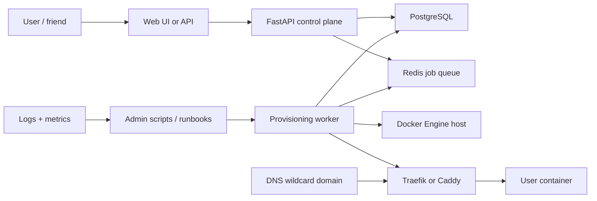

# Compute Provisioning Service Research and Agentic Roadmap

Generated: 2026-06-24

Audience: A DevOps/security intern who needs a portfolio project that demonstrates networking, provisioning, backend basics, security judgment, CI/CD, and cloud readiness.

Primary goal: Build a learning-first compute provisioning service inspired by providers like Shockbyte, Hetzner, DigitalOcean, Netlify, and cloud platforms. The first version should be small enough to finish in about 8 weeks, cheap enough to run on one VPS, and structured enough to grow later.

Non-negotiable learning rule for the coding agent: Before writing code in every section, quiz the user. Grill them gently but seriously. Ask what the component does, what failure mode matters, what security risk exists, and how they would debug it. After writing code, quiz them again with flash cards and make them explain the change back.

## Executive Summary

The project should start as a small "control plane" that accepts requests like "create a basic web container for user X", records desired state in a database, queues a provisioning job, and has a worker create the actual compute resource on a host. For the first milestone, use Docker containers on one VPS. This gets you the fundamentals quickly: networking, reverse proxies, resource limits, firewalls, logs, database state, async jobs, and deployment.

Do not start with a full cloud provider clone. Providers have huge systems for capacity planning, billing, abuse detection, multi-region networking, hardware inventory, orchestration, support tooling, and internal APIs. Your project should model the important shape without pretending to be a business.

Recommended stack:

- Python FastAPI for the backend API.
- PostgreSQL for state.
- Redis plus RQ, Dramatiq, or Celery for background provisioning jobs.
- Docker Engine on a single Linux VPS for the first compute substrate.
- Traefik or Caddy for reverse proxy and HTTPS.
- GitHub Actions for tests and image build.
- Docker Compose for initial deployment.
- Later: libvirt/KVM and cloud-init for real VM practice.
- Later: Hetzner or DigitalOcean API integration for external VM provisioning.
- AWS should be learned in a contained lab, not as the first always-on hosting target.

## Research Takeaways

Shockbyte-like game hosting, cloud VM providers, and static hosting platforms differ in surface area, but they share a few core ideas:

- A user-facing app accepts a provisioning request.
- A database stores users, plans/templates, desired state, actual state, and job history.
- A worker performs slow or privileged infrastructure actions outside the web request.
- A compute substrate creates the resource: Docker container, VM, Kubernetes pod, cloud instance, static deploy, or serverless function.
- A network layer connects the resource to users through public IPs, private networks, firewalls, ports, DNS, reverse proxies, and TLS.
- A reconciliation loop checks whether reality still matches the database.
- Cleanup and cost control are first-class features, not afterthoughts.

Public references:

- Shockbyte review showing the user-facing shape: fast setup, control panel, server type selection, file access, plugins/modpacks, console, scheduled tasks, additional ports, startup parameters, and MySQL databases: [TechRadar Shockbyte review](https://www.techradar.com/reviews/shockbyte)
- Open-source game-hosting analog: Pterodactyl Panel is a self-hosted panel with a web server, database, Redis queues, and Wings running game servers in Docker: [Pterodactyl getting started](https://pterodactyl.io/panel/1.0/getting_started.html), [Pterodactyl Wings configuration](https://pterodactyl.io/wings/1.0/configuration.html)
- Hetzner Cloud exposes servers, load balancers, volumes, firewalls, floating IPs, and networks through APIs: [Hetzner Cloud API overview](https://docs.hetzner.cloud/), [Hetzner cloud servers](https://docs.hetzner.com/cloud/servers/overview/), [Hetzner networks](https://docs.hetzner.com/networking/networks/overview/), [Hetzner firewalls](https://docs.hetzner.com/cloud/firewalls/overview/)
- DigitalOcean Droplets are Linux VMs with API/CLI creation and cloud-init user data: [DigitalOcean user data during Droplet creation](https://docs.digitalocean.com/products/droplets/how-to/provide-user-data/), [DigitalOcean VPC docs](https://docs.digitalocean.com/products/networking/vpc/)
- Netlify's provisioning model is more build/deploy than raw compute, but it is useful for thinking about build workers, immutable deploys, logs, previews, and routing: [Netlify build configuration](https://docs.netlify.com/build/configure-builds/overview/), [Netlify deploy overview](https://docs.netlify.com/deploy/deploy-overview/)
- Docker gives the cheapest useful first substrate: [Docker overview](https://docs.docker.com/get-started/docker-overview/), [Docker resource constraints](https://docs.docker.com/engine/containers/resource_constraints/), [Docker networking](https://docs.docker.com/engine/network/)
- cloud-init is the common VM bootstrapping mechanism: [cloud-init introduction](https://docs.cloud-init.io/en/latest/explanation/introduction.html)
- libvirt is the learning path for local VM provisioning: [libvirt daemons](https://libvirt.org/daemons.html), [Ubuntu libvirt docs](https://ubuntu.com/server/docs/how-to/virtualisation/libvirt/)
- Terraform/OpenTofu teaches infrastructure-as-code patterns: [Terraform intro](https://developer.hashicorp.com/terraform/intro), [Terraform providers](https://developer.hashicorp.com/terraform/language/providers), [OpenTofu install docs](https://opentofu.org/docs/intro/install/)
- Ansible teaches configuration management and idempotence: [Ansible intro](https://docs.ansible.com/projects/ansible/latest/getting_started/introduction.html), [Ansible playbooks](https://docs.ansible.com/projects/ansible/latest/playbook_guide/playbooks_intro.html)

## Big Picture Concepts To Add To The Original List

Add these to the learning list because real provisioning systems depend on them:

- Control plane vs data plane.
- Async jobs and queues.
- Desired state vs actual state.
- Idempotency and retries.
- State machines for resource lifecycle.
- Reconciliation loops.
- Resource quotas and rate limits.
- Secrets management.
- Audit logs.
- DNS and TLS automation.
- SSH key management.
- Image/template management.
- Capacity and cost controls.
- Observability: logs, metrics, traces, health checks.
- Backups and restore drills.
- Abuse prevention and teardown safety.
- Configuration management.
- Infrastructure as code.
- Threat modeling.
- Documentation and runbooks.

Agent quiz rule: Before adding any new concept to implementation, the agent must ask the user to define it in their own words and name one failure mode.

## Target Architecture



The first system should provision a basic HTTP service. A friend logs in, clicks "Create app", and the platform creates something like:

- A database row for the resource.
- A queued job.
- A Docker container from an approved image.
- A Docker network attachment.
- Resource limits for CPU and memory.
- Labels or config for Traefik/Caddy routing.
- A subdomain like `friend1.apps.example.com`.
- Logs and status visible in the UI.
- A stop/start/rebuild/delete lifecycle.

Do not let arbitrary users upload arbitrary Dockerfiles in the MVP. That is a large security problem. Start with approved templates.

Agent quiz rule: Before coding the architecture, ask the user to explain the path of a request from browser to container and the path of a provisioning job from API to worker.

## Provider Pattern Notes

### Shockbyte-Like Game Hosting

Public information suggests the visible product shape is: choose a plan/server type, receive quick access, use a game control panel, manage files/plugins/config, run console commands, schedule tasks, add ports, and optionally use MySQL. The exact internal Shockbyte architecture is not public, so do not claim to copy it exactly.

Use Pterodactyl as the open-source learning analog. Pterodactyl separates the panel from the node agent, uses a database and Redis queues, and runs game servers through Docker on node machines. Wings exposes the key lessons: Docker networks, port allocations, PID limits, installer limits, private registries, SFTP, and logs.

Learning target:

- Panel/control plane.
- Node/agent/data plane.
- Docker as isolation boundary.
- Port allocation.
- Per-server templates.
- Startup command and environment variables.
- File/log access.

Resources:

- [Pterodactyl getting started](https://pterodactyl.io/panel/1.0/getting_started.html)
- [Pterodactyl Wings configuration](https://pterodactyl.io/wings/1.0/configuration.html)
- [TechRadar Shockbyte review](https://www.techradar.com/reviews/shockbyte)
- YouTube search: [Pterodactyl Panel Docker game server hosting](https://www.youtube.com/results?search_query=Pterodactyl+Panel+Docker+game+server+hosting)

Agent quiz rule: Ask: "What is the difference between the panel and the node agent? Why is the node agent dangerous if exposed to users?"

### Hetzner/DigitalOcean-Style VM Providers

These providers expose a clean API over real infrastructure primitives:

- VM/server create, rebuild, resize, delete.
- Images/snapshots.
- SSH keys.
- Firewalls.
- Private networks/VPCs.
- Volumes.
- Load balancers.
- Floating/reserved IPs.
- Metadata and cloud-init user data.

For this project, the lesson is not "build a hyperscaler". The lesson is "model resource lifecycle and call a provider API safely."

Resources:

- [Hetzner Cloud API overview](https://docs.hetzner.cloud/)
- [Hetzner cloud servers](https://docs.hetzner.com/cloud/servers/overview/)
- [Hetzner networks](https://docs.hetzner.com/networking/networks/overview/)
- [Hetzner firewalls](https://docs.hetzner.com/cloud/firewalls/overview/)
- [DigitalOcean user data during Droplet creation](https://docs.digitalocean.com/products/droplets/how-to/provide-user-data/)
- [DigitalOcean VPC docs](https://docs.digitalocean.com/products/networking/vpc/)
- YouTube search: [cloud-init DigitalOcean Droplet user data tutorial](https://www.youtube.com/results?search_query=cloud-init+DigitalOcean+Droplet+user+data+tutorial)

Agent quiz rule: Ask: "Which parts of a VM are compute, storage, identity, and network? What should happen if VM creation succeeds but database update fails?"

### Netlify-Style Build And Deploy Platforms

Netlify is not mainly a VM provider. It is useful because it demonstrates another kind of provisioning:

- Connect a Git repo.
- Run a build in a controlled build environment.
- Store build output.
- Publish atomically to routing/CDN.
- Keep deploy logs and immutable previews.
- Route domains to the current deploy.

Borrow the idea of immutable releases and clear deploy logs. Do not build this first unless the project pivots from "compute provisioning" to "PaaS deploys."

Resources:

- [Netlify build configuration](https://docs.netlify.com/build/configure-builds/overview/)
- [Netlify deploy overview](https://docs.netlify.com/deploy/deploy-overview/)
- YouTube search: [Netlify build deploy lifecycle explained](https://www.youtube.com/results?search_query=Netlify+build+deploy+lifecycle+explained)

Agent quiz rule: Ask: "How is an immutable deploy different from mutating files on a running server? Why do atomic deploys prevent broken intermediate states?"

## Recommended MVP Scope

Build "TinyProvisioner": a single-host provisioning service.

MVP user story:

1. A user registers or logs in.
2. A user chooses one approved template, such as a static Nginx demo container or a tiny Python HTTP app.
3. The API creates a resource record in `pending` state.
4. A worker provisions a Docker container with memory/CPU limits and labels.
5. The reverse proxy routes `resource-slug.apps.example.com` to the container.
6. The user can view status, URL, logs, start, stop, restart, and delete.
7. The system records job events and audit events.
8. A cleanup job deletes expired resources.

What to skip at first:

- Billing.
- Multi-region.
- Kubernetes.
- Arbitrary code execution from users.
- Complex auth.
- Payments.
- Autoscaling.
- Custom VM images.
- Friend-uploaded Dockerfiles.

Agent quiz rule: Before building MVP endpoints, ask the user to describe every lifecycle state: `pending`, `provisioning`, `running`, `stopped`, `failed`, `deleting`, `deleted`.

## Data Model Draft

Core tables:

- `users`: id, email, password_hash, role, created_at.
- `templates`: id, name, image, default_cpu, default_memory_mb, exposed_port, description, enabled.
- `resources`: id, user_id, template_id, slug, desired_state, actual_state, container_id, url, cpu_limit, memory_mb, created_at, expires_at, deleted_at.
- `jobs`: id, resource_id, kind, status, attempts, last_error, started_at, finished_at.
- `events`: id, resource_id, actor_user_id, event_type, message, metadata_json, created_at.
- `api_tokens` later, only if needed.

State machine:

```text
pending -> provisioning -> running
pending -> failed
running -> stopping -> stopped
stopped -> starting -> running
running/stopped/failed -> deleting -> deleted
```

Database principles:

- The database stores desired state and visible state.
- The worker is responsible for converging reality toward desired state.
- Every job must be safe to retry.
- Every external identifier, such as a container ID, must be stored after creation.
- Every delete path must tolerate already-deleted containers.

Resources:

- [PostgreSQL tutorial](https://www.postgresql.org/docs/current/tutorial.html)
- [PostgreSQL data definition](https://www.postgresql.org/docs/current/ddl.html)
- [PostgreSQL transactions](https://www.postgresql.org/docs/current/tutorial-transactions.html)
- YouTube search: [PostgreSQL database design for beginners](https://www.youtube.com/results?search_query=PostgreSQL+database+design+for+beginners)

Agent quiz rule: Ask the user to explain why provisioning should not happen inside the HTTP request and why transactions matter when creating resource/job rows.

## Concept Roadmap

### 1. Basic Auth

Goal: Implement simple user accounts with email/password and sessions or bearer tokens. Keep it boring and secure.

Recommended approach:

- Use framework-supported password hashing.
- Store password hashes, never passwords.
- Use HTTP-only cookies or short-lived bearer tokens.
- Add role checks: user vs admin.
- Add basic rate limiting on login.
- Require TLS in deployment.
- Skip OAuth until later.

Python path: FastAPI plus `passlib`/Argon2 or a vetted auth package.

Ruby path: Rails API mode plus a proven authentication gem.

Resources:

- [OWASP Authentication Cheat Sheet](https://cheatsheetseries.owasp.org/cheatsheets/Authentication_Cheat_Sheet.html)
- [FastAPI security first steps](https://fastapi.tiangolo.com/tutorial/security/first-steps/)
- [Rails API-only applications](https://guides.rubyonrails.org/api_app.html)
- YouTube search: [FastAPI authentication JWT cookies tutorial](https://www.youtube.com/results?search_query=FastAPI+authentication+JWT+cookies+tutorial)

Agent quiz rule: Before writing auth code, ask: "What is stored in the database? What should never be logged? Why does TLS matter even with hashed passwords?"

Flash cards:

- AuthN means verifying who someone is.
- AuthZ means deciding what they are allowed to do.
- A password hash is not encryption.
- A session token is a bearer secret.

Acceptance criteria:

- User can register and log in.
- Passwords are hashed.
- Protected endpoints reject anonymous requests.
- Users cannot access other users' resources.

### 2. Backend API Basics

Goal: Build a small API with clear resource boundaries.

Recommended endpoints:

- `POST /auth/register`
- `POST /auth/login`
- `GET /me`
- `GET /templates`
- `POST /resources`
- `GET /resources`
- `GET /resources/{id}`
- `POST /resources/{id}/start`
- `POST /resources/{id}/stop`
- `POST /resources/{id}/restart`
- `DELETE /resources/{id}`
- `GET /resources/{id}/events`
- `GET /resources/{id}/logs`

Resources:

- [FastAPI tutorial](https://fastapi.tiangolo.com/tutorial/)
- [Rails API-only applications](https://guides.rubyonrails.org/api_app.html)
- YouTube search: [FastAPI REST API PostgreSQL tutorial](https://www.youtube.com/results?search_query=FastAPI+REST+API+PostgreSQL+tutorial)

Agent quiz rule: Before each endpoint, ask the user: "What request comes in? What validation happens? What database rows change? What response should return?"

Acceptance criteria:

- OpenAPI/docs page works if FastAPI is used.
- Endpoint names map cleanly to resources and actions.
- API returns stable error formats.
- Tests cover success, forbidden, not found, and failed validation paths.

### 3. Database Basics

Goal: Store state clearly enough that a failed job can be debugged.

Lessons:

- Tables and relationships.
- Migrations.
- Foreign keys.
- Unique constraints, especially for resource slug and email.
- Transactions.
- Idempotency keys for create actions.
- Audit/event history.

Resources:

- [PostgreSQL tutorial](https://www.postgresql.org/docs/current/tutorial.html)
- [PostgreSQL transactions](https://www.postgresql.org/docs/current/tutorial-transactions.html)
- YouTube search: [SQL transactions explained PostgreSQL](https://www.youtube.com/results?search_query=SQL+transactions+explained+PostgreSQL)

Agent quiz rule: Before writing migrations, ask the user to sketch the tables and explain what happens when provisioning fails halfway.

Acceptance criteria:

- Migrations can create/drop schema from scratch.
- Seed data creates one or two safe templates.
- Foreign keys protect ownership and template references.
- Resource events are append-only.

### 4. Provisioning

Goal: Convert an API request into a real resource.

Provisioning flow:

1. API validates request.
2. API creates `resource` and `job` rows in a transaction.
3. Worker picks up job.
4. Worker marks resource `provisioning`.
5. Worker creates container/network/proxy config.
6. Worker records external IDs.
7. Worker marks resource `running`.
8. If anything fails, worker records error and marks `failed`.
9. Reconciler later checks if actual state matches database.

Important patterns:

- Do not run provisioning in a web request.
- Make jobs idempotent.
- Use retries with backoff.
- Store enough event history to debug.
- Prefer allowlisted templates.
- Always implement delete/cleanup early.

Resources:

- [Pterodactyl getting started](https://pterodactyl.io/panel/1.0/getting_started.html)
- [Ansible intro](https://docs.ansible.com/projects/ansible/latest/getting_started/introduction.html)
- [Ansible playbooks](https://docs.ansible.com/projects/ansible/latest/playbook_guide/playbooks_intro.html)
- YouTube search: [background jobs FastAPI Redis RQ Celery tutorial](https://www.youtube.com/results?search_query=FastAPI+Redis+background+jobs+RQ+Celery+tutorial)

Agent quiz rule: Before worker code, ask: "What makes this job safe to run twice? What external actions can partially succeed?"

Acceptance criteria:

- Creating a resource returns quickly with `pending`.
- Worker creates resource asynchronously.
- Failed jobs store a readable error.
- Retrying a job does not create duplicate containers.

### 5. Docker

Goal: Use Docker as the first compute substrate.

What to learn:

- Images vs containers.
- Docker daemon and API.
- Container lifecycle.
- Bridge networks.
- Published ports vs internal ports.
- Volumes.
- Resource limits.
- Logs.
- Security hardening.

MVP Docker rules:

- Use only approved images.
- Set memory limits.
- Set CPU limits.
- Drop unneeded Linux capabilities where possible.
- Run as non-root inside templates where possible.
- Use one private Docker network for provisioned apps.
- Do not expose the Docker socket to user containers.

Resources:

- [Docker overview](https://docs.docker.com/get-started/docker-overview/)
- [Docker resource constraints](https://docs.docker.com/engine/containers/resource_constraints/)
- [Docker networking](https://docs.docker.com/engine/network/)
- [OWASP Docker Security Cheat Sheet](https://cheatsheetseries.owasp.org/cheatsheets/Docker_Security_Cheat_Sheet.html)
- YouTube search: [Docker networking and resource limits tutorial](https://www.youtube.com/results?search_query=Docker+networking+resource+limits+tutorial)

Agent quiz rule: Before Docker code, ask: "What is the difference between exposing a port and publishing a port? Why is `/var/run/docker.sock` dangerous?"

Acceptance criteria:

- Worker can create, start, stop, restart, delete containers.
- Containers have predictable names/labels.
- Containers have CPU and memory limits.
- Logs can be fetched safely.
- Delete is idempotent.

### 6. Virtual Networks

Goal: Understand private networking for containers and VMs.

MVP:

- Put user containers on an internal Docker network.
- Only the reverse proxy should receive public traffic.
- Avoid publishing random host ports unless needed.
- Later, add per-resource network isolation if practical.

Cloud VM later:

- Use a VPC/private network.
- Place app VMs behind a public proxy or load balancer.
- Use firewall rules to expose only needed ports.

Resources:

- [Docker networking](https://docs.docker.com/engine/network/)
- [Hetzner networks](https://docs.hetzner.com/networking/networks/overview/)
- [DigitalOcean VPC docs](https://docs.digitalocean.com/products/networking/vpc/)
- [AWS VPC docs](https://docs.aws.amazon.com/vpc/latest/userguide/what-is-amazon-vpc.html)
- YouTube search: [VPC networking explained for beginners](https://www.youtube.com/results?search_query=VPC+networking+explained+for+beginners)

Agent quiz rule: Ask: "Which traffic should be public, which should be private, and which should never exist?"

Acceptance criteria:

- User services are reachable through proxy URL.
- User services are not directly reachable on random host ports.
- Database and Redis are not public.

### 7. Proxies

Goal: Route public domain traffic to the right internal service.

Recommended MVP:

- Use Traefik if you want Docker label-based auto-discovery.
- Use Caddy if you want easy HTTPS and simpler static config.

For the first version, Traefik is probably the best learning match because it can discover Docker labels and dynamically route containers without rewriting config files.

Pattern:

- Public DNS wildcard: `*.apps.example.com -> VPS IP`.
- Reverse proxy listens on ports 80/443.
- Containers expose internal port, for example 8080.
- Proxy routes hostnames to container services.
- TLS is automated through ACME if using real public DNS.

Resources:

- [Traefik docs](https://doc.traefik.io/traefik/)
- [Caddy Automatic HTTPS](https://caddyserver.com/docs/automatic-https)
- YouTube search: [Traefik Docker labels reverse proxy tutorial](https://www.youtube.com/results?search_query=Traefik+Docker+labels+reverse+proxy+tutorial)

Agent quiz rule: Before proxy setup, ask: "What does DNS do, what does TLS do, and what does the reverse proxy do?"

Acceptance criteria:

- One provisioned container receives traffic by hostname.
- A second provisioned container receives traffic by a different hostname.
- HTTPS works on a real domain when deployed.

### 8. Load Balancing

Goal: Learn the concept without overbuilding.

MVP:

- No real load balancing needed.
- Keep one container per resource.
- Learn health checks and routing first.

Stretch:

- Allow a resource to have 2 replicas.
- Proxy load-balances between replicas.
- Add health checks.

Cloud later:

- Use Hetzner/DO/AWS load balancer in front of VM resources.

Resources:

- [Traefik service/load-balancing docs](https://doc.traefik.io/traefik/routing/services/)
- [AWS Elastic Load Balancing mention in EC2 docs](https://docs.aws.amazon.com/AWSEC2/latest/UserGuide/concepts.html)
- YouTube search: [load balancing explained reverse proxy health checks](https://www.youtube.com/results?search_query=load+balancing+explained+reverse+proxy+health+checks)

Agent quiz rule: Ask: "What is the difference between reverse proxying and load balancing? What makes a backend healthy?"

Acceptance criteria:

- MVP documents why load balancing is deferred.
- Stretch has two backends serving one hostname.
- Unhealthy backends are not routed to.

### 9. Network Security

Goal: Build security habits into the platform.

Minimum security controls:

- Host firewall allows only SSH, HTTP, and HTTPS.
- SSH key auth only.
- Database not public.
- Redis not public.
- Docker socket not mounted into provisioned containers.
- User containers cannot reach sensitive host services if avoidable.
- Logs do not include secrets.
- Admin operations are audited.
- Rate-limit login and provisioning.
- Apply resource quotas.

Threats to discuss:

- A user starts a crypto miner.
- A user container scans the private network.
- A template has a vulnerable image.
- A provisioning job leaks a provider API token.
- A delete bug removes the wrong container.
- A wildcard DNS or proxy config sends traffic to the wrong user.

Resources:

- [OWASP Authentication Cheat Sheet](https://cheatsheetseries.owasp.org/cheatsheets/Authentication_Cheat_Sheet.html)
- [OWASP Docker Security Cheat Sheet](https://cheatsheetseries.owasp.org/cheatsheets/Docker_Security_Cheat_Sheet.html)
- [Hetzner firewalls](https://docs.hetzner.com/cloud/firewalls/overview/)
- [AWS VPC docs](https://docs.aws.amazon.com/vpc/latest/userguide/what-is-amazon-vpc.html)
- YouTube search: [Docker security best practices tutorial](https://www.youtube.com/results?search_query=Docker+security+best+practices+tutorial)

Agent quiz rule: Before every security-relevant change, ask the user to name the attacker, the asset, and the trust boundary.

Acceptance criteria:

- Security checklist exists.
- Host firewall setup is documented.
- App has ownership checks.
- Docker socket is not exposed to user workloads.
- Provisioning actions are audit logged.

### 10. VMs

Goal: Learn real VM provisioning after Docker MVP works.

Local VM learning path:

- Install libvirt/KVM on a Linux host.
- Download a cloud image.
- Generate a cloud-init NoCloud seed.
- Create a VM with CPU, RAM, disk.
- Inject SSH keys.
- Attach to a bridge/private network.
- Start/stop/delete the VM.

Why this matters:

- VMs provide stronger isolation than containers.
- Cloud providers expose VM APIs around the same ideas: image, size, disk, network, metadata, SSH keys.

Resources:

- [cloud-init introduction](https://docs.cloud-init.io/en/latest/explanation/introduction.html)
- [libvirt daemons](https://libvirt.org/daemons.html)
- [Ubuntu libvirt docs](https://ubuntu.com/server/docs/how-to/virtualisation/libvirt/)
- [AWS EC2 concepts](https://docs.aws.amazon.com/AWSEC2/latest/UserGuide/concepts.html)
- YouTube search: [libvirt cloud-init KVM VM provisioning tutorial](https://www.youtube.com/results?search_query=libvirt+cloud-init+KVM+VM+provisioning+tutorial)

Agent quiz rule: Before VM work, ask: "What does cloud-init configure at first boot? What is the difference between an image, disk, and instance?"

Acceptance criteria:

- A local VM can be created from a template.
- The VM has an injected SSH key.
- The VM can run a first-boot script.
- The VM can be deleted cleanly.

### 11. Basic Code

Goal: Build boring, readable code.

Rules:

- Keep the API layer separate from provisioning logic.
- Keep Docker/libvirt/provider code behind a small interface.
- Put state transitions in one place.
- Use type hints.
- Add tests for behavior, not implementation trivia.
- Prefer simple modules over clever abstractions.

Possible module layout:

```text
app/
  api/
  auth/
  db/
  models/
  schemas/
  services/
  provisioners/
    docker.py
    fake.py
  workers/
  settings.py
tests/
```

Resources:

- [FastAPI tutorial](https://fastapi.tiangolo.com/tutorial/)
- [Rails API-only applications](https://guides.rubyonrails.org/api_app.html)
- YouTube search: [clean architecture FastAPI project structure](https://www.youtube.com/results?search_query=clean+architecture+FastAPI+project+structure)

Agent quiz rule: Before adding a module, ask: "Who calls this? What does it own? What should it not know about?"

Acceptance criteria:

- The fake provisioner can run tests without Docker.
- The Docker provisioner is isolated.
- Tests do not require a real cloud account.

### 12. CI/CD

Goal: Prove professional workflow.

MVP CI:

- Run linting.
- Run unit tests.
- Run database migration check if practical.
- Build Docker image.
- Do not deploy automatically until the manual deployment is understood.

Later CD:

- Push image to registry.
- SSH to VPS or use a deployment tool.
- Pull image.
- Run migrations.
- Restart services.
- Keep rollback notes.

Resources:

- [GitHub Actions docs](https://docs.github.com/en/actions/get-started/understand-github-actions)
- [Docker overview and CI/CD notes](https://docs.docker.com/get-started/docker-overview/)
- YouTube search: [GitHub Actions Docker CI CD tutorial](https://www.youtube.com/results?search_query=GitHub+Actions+Docker+CI+CD+tutorial)

Agent quiz rule: Before writing CI, ask: "What should fail the build? What secrets must not be exposed to CI logs?"

Acceptance criteria:

- Pull requests run tests.
- Main branch builds image.
- Deployment secrets are not in repo.

### 13. Basic Deployments

Goal: Run the platform on a VPS your friends can use.

Recommended deployment:

- One low-cost VPS.
- Ubuntu LTS.
- Docker Engine.
- Docker Compose.
- Services: API, worker, Postgres, Redis, Traefik/Caddy.
- Real domain with wildcard DNS.
- Host firewall.
- Backups for Postgres.

Deployment checklist:

- Create non-root deploy user.
- Configure SSH key login.
- Disable password SSH login.
- Install Docker.
- Set firewall.
- Configure domain.
- Start Docker Compose stack.
- Run migrations.
- Create admin user.
- Test provisioning.
- Test teardown.
- Test restart after reboot.

Resources:

- [Docker overview](https://docs.docker.com/get-started/docker-overview/)
- [Caddy Automatic HTTPS](https://caddyserver.com/docs/automatic-https)
- [Traefik docs](https://doc.traefik.io/traefik/)
- YouTube search: [Docker Compose deploy FastAPI PostgreSQL VPS Traefik](https://www.youtube.com/results?search_query=Docker+Compose+deploy+FastAPI+PostgreSQL+VPS+Traefik)

Agent quiz rule: Before deployment scripts, ask: "What ports should be open? What data must survive container restarts? How do we roll back?"

Acceptance criteria:

- App survives VPS reboot.
- Provisioned resources survive restart unless intentionally ephemeral.
- Database backup process is documented.
- Friend can access a provisioned URL.

### 14. AWS Basics

Goal: Learn career-relevant AWS without accidentally building a cost trap.

AWS concepts to learn:

- IAM users/roles/policies.
- EC2 instances.
- AMIs.
- Security groups.
- VPC/subnets/route tables/internet gateway.
- EBS volumes.
- Elastic Load Balancing.
- CloudWatch logs/metrics.
- Budget alarms.

Cost reality as of 2026-06-24:

- AWS Free Tier currently advertises up to $200 in credits for new customers, with a Free plan that closes after 6 months or when credits run out unless upgraded. Source: [AWS Free Tier](https://aws.amazon.com/free/)
- AWS VPC itself has no extra charge, but NAT gateways, public IPv4 addresses beyond free-tier allowances, and other VPC components can cost money. Source: [AWS VPC docs](https://docs.aws.amazon.com/vpc/latest/userguide/what-is-amazon-vpc.html)
- EC2 is valuable to learn but easy to leave running. Use budgets and teardown scripts.

Recommended AWS usage:

- Do one contained lab: create VPC, subnet, security group, EC2, SSH in, run Docker, destroy everything.
- Do not host the main project on AWS first unless you are comfortable monitoring costs.
- Add AWS provider integration only after Hetzner/DO/local Docker works.

Resources:

- [AWS Free Tier](https://aws.amazon.com/free/)
- [AWS EC2 concepts](https://docs.aws.amazon.com/AWSEC2/latest/UserGuide/concepts.html)
- [AWS VPC docs](https://docs.aws.amazon.com/vpc/latest/userguide/what-is-amazon-vpc.html)
- YouTube search: [AWS EC2 VPC IAM basics for DevOps beginners](https://www.youtube.com/results?search_query=AWS+EC2+VPC+IAM+basics+DevOps+beginners)

Agent quiz rule: Before any AWS action, ask: "What will this cost if left on for a month? How will we destroy it? What IAM permissions are minimally required?"

Acceptance criteria:

- AWS lab has a teardown command/checklist.
- AWS budget alarm is documented.
- No long-lived AWS resources are required for the MVP.

### 15. Cost Strategy

Goal: Learn without anxiety.

Suggested cost path:

- Local laptop: free, use Docker first.
- One small VPS: best for the actual public demo. Hetzner and DigitalOcean are usually simpler and more predictable than AWS for a tiny always-on project.
- GCP: strong free tier for learning, including $300 credits for new customers and listed always-free products such as one e2-micro per month in eligible conditions, Cloud Run free requests, and Cloud Build free minutes. Source: [Google Cloud Free Program](https://cloud.google.com/free)
- Azure: has free services and 12-month VM allowances, but can be complex. Source: [Azure free services](https://azure.microsoft.com/en-us/pricing/free-services)
- AWS: excellent career learning, but use labs and teardown scripts first.

Recommended public demo host:

- Cheapest/simplest: one VPS with Docker Compose.
- Cloud API learning: Hetzner or DigitalOcean.
- AWS learning: separate lab branch and docs, not always-on production.

Cost controls:

- Hardcode max resources per user.
- Add expiration dates to resources.
- Cleanup job runs daily.
- Admin dashboard shows total running resources.
- Require admin approval for VM/cloud provisioning.
- Store provider resource IDs and tags/labels for cleanup.
- Have a "destroy all dev resources" command.

Resources:

- [AWS Free Tier](https://aws.amazon.com/free/)
- [Google Cloud Free Program](https://cloud.google.com/free)
- [Azure free services](https://azure.microsoft.com/en-us/pricing/free-services)
- [Hetzner cloud servers](https://docs.hetzner.com/cloud/servers/overview/)
- YouTube search: [cloud cost management beginner budgets AWS GCP Azure](https://www.youtube.com/results?search_query=cloud+cost+management+beginner+budgets+AWS+GCP+Azure)

Agent quiz rule: Before provisioning anything paid, ask the user to estimate monthly cost and identify the cleanup path.

Acceptance criteria:

- Max one running resource per non-admin user in MVP.
- Expired resources are deleted.
- Admin can see total running resources.
- All provider resources are tagged/labeled.

## 8-Week Build Plan

Every week starts with a quiz and ends with flash cards. The coding agent must not skip this.

### Week 1: Foundations And Design

Build:

- Project skeleton.
- README with architecture.
- FastAPI health check.
- PostgreSQL connection.
- Docker Compose for local dev.
- First migration.

Study:

- Control plane vs data plane.
- HTTP API basics.
- PostgreSQL tables and transactions.

Resources:

- [FastAPI tutorial](https://fastapi.tiangolo.com/tutorial/)
- [PostgreSQL tutorial](https://www.postgresql.org/docs/current/tutorial.html)
- YouTube search: [FastAPI PostgreSQL Docker Compose tutorial](https://www.youtube.com/results?search_query=FastAPI+PostgreSQL+Docker+Compose+tutorial)

Agent quiz before coding:

- Define control plane and data plane.
- What belongs in Postgres?
- Why should health checks not touch expensive dependencies?

Deliverable:

- API starts locally.
- Database migrations work.
- README has architecture diagram.

### Week 2: Auth And Ownership

Build:

- Register/login.
- Current user endpoint.
- Protected routes.
- User/resource ownership checks.

Study:

- Password hashing.
- Sessions/tokens.
- AuthN vs AuthZ.

Resources:

- [OWASP Authentication Cheat Sheet](https://cheatsheetseries.owasp.org/cheatsheets/Authentication_Cheat_Sheet.html)
- [FastAPI security first steps](https://fastapi.tiangolo.com/tutorial/security/first-steps/)
- YouTube search: [FastAPI authentication tutorial](https://www.youtube.com/results?search_query=FastAPI+authentication+tutorial)

Agent quiz before coding:

- What is a password hash?
- What is a bearer token?
- How do we prevent user A from seeing user B's resources?

Deliverable:

- Auth works.
- Authorization tests pass.

### Week 3: Resource Model And Queue

Build:

- Templates.
- Resources.
- Jobs.
- Events.
- Fake provisioner.
- Worker process.

Study:

- Async jobs.
- Idempotency.
- State machines.

Resources:

- [Ansible idempotence concepts](https://docs.ansible.com/projects/ansible/latest/getting_started/introduction.html)
- [PostgreSQL transactions](https://www.postgresql.org/docs/current/tutorial-transactions.html)
- YouTube search: [idempotency background jobs distributed systems tutorial](https://www.youtube.com/results?search_query=idempotency+background+jobs+distributed+systems+tutorial)

Agent quiz before coding:

- What should happen if the worker crashes after creating something?
- What does retry-safe mean?
- Why is an event table useful?

Deliverable:

- `POST /resources` creates pending resource and job.
- Fake worker marks it running.
- Events show lifecycle.

### Week 4: Docker Provisioning

Build:

- Docker provisioner.
- Container create/start/stop/delete.
- Logs endpoint.
- CPU/memory limits.
- Labels.

Study:

- Docker images, containers, networks, volumes.
- Docker security.

Resources:

- [Docker overview](https://docs.docker.com/get-started/docker-overview/)
- [Docker resource constraints](https://docs.docker.com/engine/containers/resource_constraints/)
- [OWASP Docker Security Cheat Sheet](https://cheatsheetseries.owasp.org/cheatsheets/Docker_Security_Cheat_Sheet.html)
- YouTube search: [Docker SDK Python container create start stop logs](https://www.youtube.com/results?search_query=Docker+SDK+Python+container+create+start+stop+logs)

Agent quiz before coding:

- What labels should every container have?
- What happens if delete is called twice?
- Why should templates be allowlisted?

Deliverable:

- A resource creates a real container locally.
- User can start/stop/delete.
- Logs are visible.

### Week 5: Proxy, DNS, HTTPS

Build:

- Traefik or Caddy integration.
- Wildcard subdomains.
- Per-resource URL.
- Basic health check routing.

Study:

- DNS A records/wildcards.
- Reverse proxying.
- TLS certificates.

Resources:

- [Traefik docs](https://doc.traefik.io/traefik/)
- [Caddy Automatic HTTPS](https://caddyserver.com/docs/automatic-https)
- YouTube search: [Traefik Docker labels wildcard domain HTTPS](https://www.youtube.com/results?search_query=Traefik+Docker+labels+wildcard+domain+HTTPS)

Agent quiz before coding:

- What is the difference between DNS and reverse proxy routing?
- Why do ports 80 and 443 matter for ACME?
- How does the proxy know which container receives traffic?

Deliverable:

- Two resources route to two different hostnames.
- HTTPS plan documented, even if local dev uses HTTP.

### Week 6: Security, Quotas, Cleanup

Build:

- Max resources per user.
- Expiration date.
- Cleanup worker.
- Audit events.
- Host deployment security checklist.
- Rate limit sensitive endpoints.

Study:

- Threat modeling.
- Network boundaries.
- Resource abuse.

Resources:

- [OWASP Docker Security Cheat Sheet](https://cheatsheetseries.owasp.org/cheatsheets/Docker_Security_Cheat_Sheet.html)
- [Hetzner firewalls](https://docs.hetzner.com/cloud/firewalls/overview/)
- YouTube search: [threat modeling for developers tutorial](https://www.youtube.com/results?search_query=threat+modeling+for+developers+tutorial)

Agent quiz before coding:

- What abuse can friends accidentally or intentionally cause?
- What cleanup must run even if the API is not being used?
- What should be logged for admin review?

Deliverable:

- Quotas work.
- Cleanup deletes expired resources.
- Security checklist exists.

### Week 7: VPS Deployment

Build:

- Production Docker Compose.
- Environment variable handling.
- Migrations on deploy.
- Domain setup docs.
- Backup/restore notes.
- Manual deployment runbook.

Study:

- Linux service operations.
- Firewalls.
- Backups.
- Rollback.

Resources:

- [Docker overview](https://docs.docker.com/get-started/docker-overview/)
- [Caddy Automatic HTTPS](https://caddyserver.com/docs/automatic-https)
- YouTube search: [deploy Docker Compose app to VPS Traefik PostgreSQL](https://www.youtube.com/results?search_query=deploy+Docker+Compose+app+to+VPS+Traefik+PostgreSQL)

Agent quiz before coding/deploying:

- What data is persistent?
- What ports are open?
- How do we restore if the DB is lost?
- What is the rollback path?

Deliverable:

- Public demo works on a VPS.
- Friend can provision one safe resource.

### Week 8: Cloud/VM Extension And Portfolio Polish

Choose one extension:

- Hetzner/DigitalOcean provider integration.
- Local libvirt/KVM VM provisioning.
- AWS lab with teardown.
- Netlify-style build/deploy experiment.

Portfolio polish:

- Architecture diagram.
- Demo GIF/screenshots.
- Security notes.
- Cost notes.
- Runbook.
- What you learned.
- What you would improve with more time.

Resources:

- [cloud-init introduction](https://docs.cloud-init.io/en/latest/explanation/introduction.html)
- [Hetzner Cloud API overview](https://docs.hetzner.cloud/)
- [DigitalOcean user data docs](https://docs.digitalocean.com/products/droplets/how-to/provide-user-data/)
- [AWS EC2 concepts](https://docs.aws.amazon.com/AWSEC2/latest/UserGuide/concepts.html)
- YouTube search: [cloud-init VM provisioning tutorial](https://www.youtube.com/results?search_query=cloud-init+VM+provisioning+tutorial)

Agent quiz before coding:

- Which extension best supports the job you want?
- What new risk does this extension introduce?
- What should be mocked in tests?

Deliverable:

- One advanced extension works or is documented honestly.
- Repo looks portfolio-ready.

## Implementation Instructions For The Coding Agent

Use this section as the operating contract.

1. Start every phase with a quiz. Do not write code until the user answers or explicitly asks to proceed.
2. Keep explanations short but frequent.
3. Ask flash cards after meaningful changes.
4. Use tests as teaching tools. Explain what each test proves.
5. Prefer Python FastAPI unless the user explicitly chooses Ruby.
6. Keep security boring and practical.
7. Never provision paid cloud resources without asking the user to estimate cost and confirm teardown.
8. Build a fake provisioner before the real provisioner.
9. Keep Docker, libvirt, and cloud providers behind interfaces.
10. Store every external resource ID.
11. Tag/label every external resource with project, owner, and environment.
12. Implement delete early.
13. Add events for every lifecycle transition.
14. Avoid arbitrary user-provided Dockerfiles in MVP.
15. Do not expose the Docker socket to user workloads.
16. Do not put secrets in GitHub Actions logs or repository files.
17. Keep a runbook updated as implementation changes.

## Suggested Agent Prompts

Use these prompts repeatedly.

Before code:

- "Explain what this component is responsible for in one paragraph."
- "What could fail halfway through?"
- "What state should the database show before, during, and after this operation?"
- "What security boundary are we crossing?"
- "What test would prove this works?"

During code:

- "Pause: tell me what this function should return on success and failure."
- "What should happen if this API call is retried?"
- "Where would you look for logs if this broke?"

After code:

- "Flash card: define idempotency."
- "Flash card: why do we queue provisioning jobs?"
- "Flash card: what is the difference between desired state and actual state?"
- "Flash card: why is the Docker socket dangerous?"
- "Explain the change back to me as if you were in a job interview."

## Portfolio Narrative

Use this project to tell a hiring story:

"I built a small compute provisioning platform. It has a FastAPI control plane, Postgres state, a Redis-backed worker queue, Docker-based resource provisioning, reverse proxy routing, per-user ownership checks, resource quotas, audit events, and a VPS deployment runbook. I intentionally started with containers, then documented how I would extend it to libvirt/KVM VMs and cloud providers using cloud-init and provider APIs. The project taught me the actual shape of provisioning systems: lifecycle state, idempotent workers, networking, firewall boundaries, logs, cleanup, and cost control."

That story is strong for DevOps/security intern interviews because it connects code, infrastructure, networking, security, and operations.

## First Build Decision

Start here:

- Backend: Python FastAPI.
- Database: PostgreSQL.
- Queue: Redis + RQ or Dramatiq.
- Compute: Docker on local machine, then VPS.
- Proxy: Traefik if using Docker labels; Caddy if prioritizing simple HTTPS.
- Cloud: defer until MVP works.
- VM: defer until Docker MVP works.

First coding checkpoint:

The agent should ask the user:

1. "Explain control plane vs data plane."
2. "Why should provisioning run in a worker instead of inside the API request?"
3. "What is the first resource template we should allow: Nginx static page or tiny Python HTTP app?"

Only after that quiz should implementation begin.

