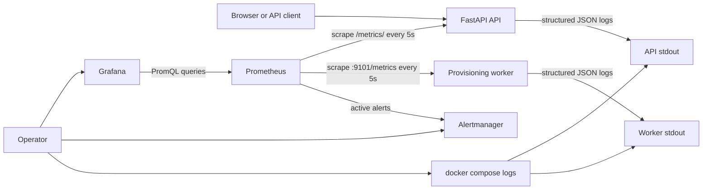

# Observability Learning Guide

TinyProvisioner now answers three different operational questions:

1. **What happened to one request or job?** Read its structured log fields.
2. **How is the platform behaving over time?** Query Prometheus metrics and Grafana panels.
3. **Which symptom needs attention now?** Inspect Prometheus alerts and Alertmanager groups.

Observability is not the same as adding a dashboard. A dashboard is only one way to read signals. The system must first produce signals with stable meaning, bounded cost, and enough context to support a diagnosis.

## Signal Flow



Prometheus uses a **pull model**: it contacts known targets and asks for their current metrics. If a target cannot be scraped, Prometheus records `up = 0`. That makes service disappearance observable without relying on the failed service to push a final message.

## The Three Pillars

### Logs

Logs describe discrete events. TinyProvisioner writes one JSON object per application log line.

Example API completion event:

```json
{
  "timestamp": "2026-07-21T15:30:00.000000+00:00",
  "level": "info",
  "service": "api",
  "logger": "tinyprovisioner.api",
  "event": "http.request.completed",
  "request_id": "lesson-request-123",
  "method": "GET",
  "route": "/resources/{resource_id}",
  "status_code": 200,
  "duration_ms": 8.421
}
```

Example worker event:

```json
{
  "timestamp": "2026-07-21T15:30:04.000000+00:00",
  "level": "info",
  "service": "worker",
  "logger": "tinyprovisioner.worker",
  "event": "worker.job.completed",
  "worker_id": "worker-host-1234-abcd1234",
  "job_id": 42,
  "job_kind": "provision_resource",
  "resource_id": 17,
  "attempt": 1,
  "result": "succeeded",
  "duration_ms": 241.703
}
```

The API accepts a safe `X-Request-ID` header or creates one. It returns the selected ID in the response. This lets an operator connect a client-visible failure with the exact server-side log event.

Request IDs, job IDs, resource IDs, and worker IDs are appropriate **log fields**. They are intentionally not Prometheus labels because they can grow without limit.

Passwords, access tokens, authorization headers, and user emails are never observability fields.

### Metrics

Metrics are numeric measurements designed for aggregation over time. TinyProvisioner uses counters, gauges, and histograms:

| Type | Behavior | TinyProvisioner example |
| --- | --- | --- |
| Counter | Only increases until the process restarts | completed HTTP requests |
| Gauge | Can increase or decrease | jobs currently queued |
| Histogram | Counts observations in duration buckets | HTTP request latency |

Prometheus stores each unique metric-and-label combination as a time series. Labels must therefore come from bounded sets.

Safe labels used here:

- HTTP method
- FastAPI route template such as `/resources/{resource_id}`
- HTTP status code
- controlled job kind
- controlled job result
- controlled queue status

Unsafe metric labels:

- `/resources/987654` as a literal path
- request ID
- job or resource ID
- email address
- full exception message

### Traces

A trace follows one operation across multiple services and represents its nested spans. TinyProvisioner currently provides correlation IDs and structured events but does not yet export OpenTelemetry spans. A later extension can add OpenTelemetry and Tempo without changing the metric contract.

Being explicit about this boundary is better than claiming that request IDs alone are distributed tracing.

## Metric Catalog

### API RED metrics

RED means **Rate, Errors, and Duration**.

| Metric | Type | Labels | Meaning |
| --- | --- | --- | --- |
| `tinyprovisioner_http_requests_total` | Counter | method, route, status_code | completed requests |
| `tinyprovisioner_http_request_duration_seconds` | Histogram | method, route | request latency distribution |
| `tinyprovisioner_http_requests_in_progress` | Gauge | method | requests currently executing |

### Worker metrics

| Metric | Type | Labels | Meaning |
| --- | --- | --- | --- |
| `tinyprovisioner_worker_job_claims_total` | Counter | kind | atomic database claims |
| `tinyprovisioner_worker_job_results_total` | Counter | kind, result | attempt outcomes |
| `tinyprovisioner_worker_job_duration_seconds` | Histogram | kind, result | processing duration |
| `tinyprovisioner_worker_queue_depth` | Gauge | status | durable jobs by state |
| `tinyprovisioner_worker_last_successful_loop_timestamp_seconds` | Gauge | none | latest successful poll timestamp |
| `tinyprovisioner_worker_loop_duration_seconds` | Histogram | result | worker polling-loop duration |
| `tinyprovisioner_worker_recovered_jobs_total` | Counter | outcome | expired leases recovered |

The worker metrics server listens on port `9101` inside the Compose network. It is not published to the host. Prometheus can reach it by the Compose DNS name `worker`, while external clients cannot access it directly.

## Prometheus and PromQL

Prometheus scrapes the API and worker every five seconds. Open its expression browser at:

```text
http://127.0.0.1:9090
```

Request rate over five minutes:

```promql
sum(rate(tinyprovisioner_http_requests_total[5m]))
```

5xx error ratio:

```promql
sum(rate(tinyprovisioner_http_requests_total{status_code=~"5.."}[5m]))
/
sum(rate(tinyprovisioner_http_requests_total[5m]))
```

When there is no traffic, this division returns no series rather than inventing a percentage. The Grafana panel adds `or vector(0)` only as a display fallback. It does not change the alert calculation for real traffic.

95th-percentile request latency:

```promql
histogram_quantile(
  0.95,
  sum by (le) (rate(tinyprovisioner_http_request_duration_seconds_bucket[5m]))
)
```

Current queued work:

```promql
tinyprovisioner_worker_queue_depth{status="queued"}
```

Seconds since the worker completed a healthy loop:

```promql
time() - tinyprovisioner_worker_last_successful_loop_timestamp_seconds
```

## Grafana as Code

Open Grafana at:

```text
http://127.0.0.1:3000
```

Local credentials come from `.env` and default to `admin` / `admin`. Change them if the machine is shared.

The Prometheus datasource and `TinyProvisioner Platform Overview` dashboard are provisioned from files under `observability/grafana/`. Grafana loads these files on startup, which gives the project three useful properties:

1. Dashboard changes are reviewed in Git.
2. A fresh environment receives the same dashboard.
3. The dashboard can be restored without clicking through the UI.

The provisioned dashboard is intentionally read-only in the UI. Edit the JSON source and restart Grafana to make durable changes.

## SLI, SLO, and Alert

These terms describe different layers:

- **SLI:** a measured indicator, such as the ratio of non-5xx requests.
- **SLO:** a target for that indicator, such as 99.5% over 30 days.
- **Alert:** a notification condition that suggests operator action.

Starter portfolio SLOs:

| User promise | SLI | Starter objective |
| --- | --- | --- |
| API availability | `1 - 5xx / all requests` | 99.5% over 30 days |
| API responsiveness | requests completed below 1 second | 95% over 30 days |
| Job start delay | queued-to-claimed duration | 95% below 30 seconds |

The third SLI is not implemented yet because the current metrics do not export queue-wait duration. That is a useful next exercise: add a histogram based on `claimed_at - created_at`.

Alerts in `observability/prometheus/alerts.yml` focus on symptoms:

- API cannot be scraped
- worker cannot be scraped
- worker is reachable but its loop is stale
- API 5xx ratio is high
- API p95 latency is high
- durable queue backlog is growing
- a job entered the dead-letter state

The `for` duration prevents a brief spike from immediately paging an operator. Prometheus evaluates conditions; Alertmanager groups, deduplicates, and silences them. The local Alertmanager receiver intentionally sends no external notification. A production deployment can add email, Slack, PagerDuty, or another receiver using secrets that are not committed to Git.

## Operating the Stack

Start all services:

```bash
docker compose up --build -d
```

Inspect service state:

```bash
docker compose ps
```

Generate an identifiable request:

```bash
curl -i -H 'X-Request-ID: lesson-request-123' http://127.0.0.1:8000/health
```

Read structured logs:

```bash
docker compose logs --tail 20 api worker
```

If `jq` is installed, format only the JSON application events:

```bash
docker compose logs --no-log-prefix api worker | jq -R 'fromjson? | select(.)'
```

Open the tools:

- Control panel: `http://127.0.0.1:8000`
- Grafana: `http://127.0.0.1:3000`
- Prometheus: `http://127.0.0.1:9090`
- Alertmanager: `http://127.0.0.1:9093`

Production Compose binds all three observability UIs to server loopback. Use an SSH tunnel instead of exposing them publicly:

```bash
ssh \
  -L 3000:127.0.0.1:3000 \
  -L 9090:127.0.0.1:9090 \
  -L 9093:127.0.0.1:9093 \
  your-user@your-vps
```

## Hands-On Failure Labs

### Lab 1: Follow a request ID

1. Send the `lesson-request-123` health request shown above.
2. Read the API logs.
3. Find the event whose `request_id` matches the response header.
4. Explain why the request ID is useful in logs but harmful as a metric label.

### Lab 2: Watch a worker-down alert

Stop only the worker:

```bash
docker compose stop worker
```

Observe:

1. Prometheus **Status > Targets** changes the worker target to down.
2. `up{job="tinyprovisioner-worker"}` becomes `0`.
3. The alert becomes pending and then firing after its one-minute `for` period.
4. Alertmanager receives and groups the alert.

Recover:

```bash
docker compose start worker
```

### Lab 3: Distinguish target-down from loop-stale

Stop PostgreSQL while leaving the worker process alive:

```bash
docker compose stop postgres
```

The worker metrics endpoint remains reachable, so Prometheus still records the worker target as up. Database loops fail, however, so the last-successful-loop timestamp becomes stale. This is a different failure mode from a missing process.

Recover:

```bash
docker compose start postgres
```

Watch the loop-age panel return to a low number.

### Lab 4: Read a histogram

1. Send several requests to `/health` and `/templates`.
2. Query `tinyprovisioner_http_request_duration_seconds_bucket`.
3. Notice that each bucket is cumulative.
4. Use `histogram_quantile` to estimate p95 latency.
5. Explain why averages can hide a slow tail.

## Runbooks

### API or worker down

1. Run `docker compose ps`.
2. Inspect `docker compose logs --tail 100 api worker`.
3. Check whether the process exited, restarted, or failed a dependency connection.
4. Confirm PostgreSQL and Redis state.
5. Restart only the failed service after identifying the cause.
6. Confirm the Prometheus target returns to `up = 1`.

### Stale worker loop

1. Confirm `up{job="tinyprovisioner-worker"} == 1`.
2. Read `worker.database_unavailable` and heartbeat log events.
3. Check PostgreSQL reachability and migrations.
4. Query the workers table and job leases.
5. Confirm the last-successful-loop metric advances after recovery.

### High API error ratio

1. Break errors down by route and status code in Grafana.
2. Find matching request IDs in API logs.
3. Check database, Redis, and Docker dependency health.
4. Roll back a recent change if the failure began after deployment.
5. Confirm error rate returns below the threshold.

### High API latency

1. Identify the affected route template.
2. Compare p50, p95, and p99 latency instead of only the average.
3. Check database query time and external Docker or SSH calls.
4. Inspect requests-in-progress for saturation.
5. Capture evidence before changing capacity or code.

### Queue backlog

1. Confirm the worker is up and its loop timestamp advances.
2. Compare claim rate with incoming queued work.
3. Inspect job kinds and retry events.
4. Check whether one resource is serialized behind a long-running job.
5. Scale workers only after confirming the work is safe to parallelize.

### Dead-letter job

1. Find the `worker.job.dead` log event.
2. Inspect the job's `last_error`, attempts, and resource events.
3. Decide whether the cause is permanent or transient.
4. Fix the cause before replaying work.
5. Do not blindly reset all dead jobs; replay is an operator decision.

## Current Boundaries

- Logs remain in container stdout and are not yet shipped to Loki or another central store.
- Request IDs provide correlation, not full distributed tracing.
- The local Alertmanager receiver does not send external notifications.
- Prometheus storage is local to one Docker volume and is not highly available.
- The API metrics endpoint shares the API port. Any future public ingress must explicitly block `/metrics/` or protect it with an internal route.

These boundaries are appropriate for a learning environment and should be stated honestly in interviews.

## Further Reading

- [Prometheus Python client](https://prometheus.github.io/client_python/)
- [Prometheus metric and label naming](https://prometheus.io/docs/practices/naming/)
- [Prometheus alerting rules](https://prometheus.io/docs/prometheus/latest/configuration/alerting_rules/)
- [Grafana provisioning](https://grafana.com/docs/grafana/latest/administration/provisioning/)
