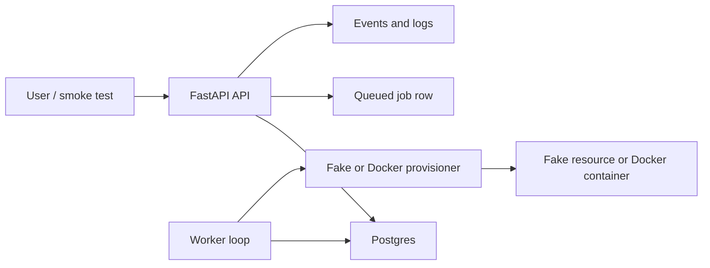

# TinyProvisioner Study Guide

This guide is your map for understanding what you are building. Treat it like a small book: read one section, open the code, answer the quiz, then run or modify something.

## What You Built

TinyProvisioner is a small compute provisioning platform. It lets a user request a resource, records that request in a database, queues background work, and has a worker move the resource through lifecycle states.

The current project has two provisioner modes:

- `fake`: simulates provisioning so you can prove the control plane works.
- `docker`: creates real Docker containers and labels them for Traefik routing.

The most important idea:

```text
API request -> database state -> queued job -> worker -> provisioner -> updated state
```

That loop is the heart of the project.

## Mental Model



The API is the control plane. It decides what should happen and records intent.

The provisioner is the data plane adapter. It talks to the thing that creates/runs workloads.

The worker is the bridge. It turns queued intent into real action.

## Reading Order

Read in this order:

1. [app/state.py](../app/state.py): lifecycle vocabulary.
2. [app/models.py](../app/models.py): database shape.
3. [app/schemas.py](../app/schemas.py): API input/output contracts.
4. [app/api/routes.py](../app/api/routes.py): HTTP entrypoints.
5. [app/services/auth.py](../app/services/auth.py): auth and tokens.
6. [app/services/resources.py](../app/services/resources.py): resource creation, quota, lifecycle job queueing.
7. [app/worker.py](../app/worker.py): queued jobs become actions.
8. [app/provisioners/fake.py](../app/provisioners/fake.py): safe fake backend.
9. [app/provisioners/docker.py](../app/provisioners/docker.py): real Docker backend.
10. [scripts/smoke_test.py](../scripts/smoke_test.py): end-to-end user simulation.

## Core Concepts

### Control Plane

The control plane is the decision-making layer. In this project, the API and database are the control plane.

It answers:

- Who is asking?
- Are they allowed?
- What resource do they want?
- What state should exist?
- What job should be queued?

Quiz:

- Why does the API create a job instead of directly creating a container?
- What table records the history of what happened?

### Data Plane

The data plane is where the actual workload exists. In this project, fake resources and Docker containers represent the data plane.

It answers:

- Is the workload running?
- How do logs get fetched?
- How is traffic routed?
- What external ID identifies the workload?

Quiz:

- Why does every real resource need an `external_id`?
- What would happen if the database forgot the Docker container ID?

### Desired State vs Actual State

`desired_state` means what the platform wants.

`actual_state` means what is currently true or currently happening.

Example:

```text
desired_state = running
actual_state = pending
```

This means the user wants a running resource, but the worker has not finished yet.

Quiz:

- Why can desired and actual state be different?
- What actual state should appear while delete is in progress?

### Jobs

Jobs are database records that tell the worker what to do.

Examples:

- `provision_resource`
- `stop_resource`
- `start_resource`
- `restart_resource`
- `delete_resource`

Quiz:

- Why are jobs safer than doing long work inside an API request?
- What should happen if a job fails halfway through?

### Events

Events are the audit trail. They explain what happened to a resource over time.

Examples:

- `resource.created`
- `resource.provisioning`
- `resource.running`
- `resource.stop_queued`
- `resource.deleted`

Quiz:

- How would events help you debug a friend saying "my app never started"?
- Why should events be append-only?

### Idempotency

Idempotency means repeating an operation is safe.

Example: deleting a resource twice should not create two delete jobs or crash because the container is already gone.

Quiz:

- Why is idempotency important for retries?
- Which operations in this project must be idempotent?

### Quotas and Expiration

Quotas protect capacity and cost. Expiration protects you from forgotten resources.

In this project:

- `MAX_ACTIVE_RESOURCES_PER_USER` limits active resources.
- `DEFAULT_RESOURCE_TTL_HOURS` sets expiration.
- The worker queues cleanup for expired resources.

Quiz:

- Why do stopped resources still count toward quota in the MVP?
- What could happen if expiration cleanup was not idempotent?

### Reverse Proxy

Traefik receives public traffic and routes it to private containers based on hostnames.

Example:

```text
smoke-demo.apps.example.com -> Traefik -> correct Docker container
```

Quiz:

- Why should user containers not publish random host ports?
- What does wildcard DNS make possible?

## What The Smoke Test Proved

When the smoke test passed, it proved:

- The API process starts.
- Database tables exist.
- A user can register/login.
- A bearer token can authenticate protected requests.
- A template exists.
- Creating a resource creates a resource, job, and event.
- The worker can process the queued job.
- Resource state changes from `pending` to `running`.
- Logs and events endpoints work.
- Stop/start/delete lifecycle actions work.
- Delete eventually reaches `deleted`.

It did not prove:

- Docker containers can be created.
- Traefik can route to those containers.
- VPS firewall rules are correct.
- Real HTTPS certificates work.

That is why the next runtime milestone is the Docker backend smoke test.

## Interview Story

Practice saying this:

"I built a small provisioning platform. The API stores desired state in Postgres and queues jobs. A worker processes lifecycle jobs and calls a provisioner interface. I started with a fake provisioner so I could test the control plane safely, then added a Docker provisioner that creates containers on a private network with resource limits and Traefik labels. The project includes auth, ownership checks, lifecycle states, events, quotas, expiration cleanup, smoke tests, deployment config, and runbooks."

## Study Routine

For each file:

1. Read the file once without stopping.
2. Read the function names only.
3. Pick one function and explain its input, output, and failure modes.
4. Find the matching test.
5. Change one small thing in a test and predict the failure.
6. Revert the test change.
7. Explain the file out loud in 60 seconds.

